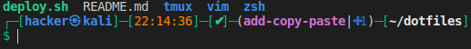

# My Custom Dotfiles
This repository contains my custom dotfiles for *Zsh*, *Vim* and *Tmux*. Initially I used various repositories from other persons, but these contained a lot of other configurations from which I didn't know exactly what it was doing and in what way or form they conflicted with eachother. Therefore I switched to a vanilla setup that only contains the settings that I specifically use. Besides the settings for the various programs it also contains a deployment script that is used for installation. Next the repository contains a list with resources where pieces of code or environment suggestions where found.

# Installation
Installation is very easy. It only contains two steps:
```default
git clone https://github.com/snu1v3r/dotfiles.git
~/dotfiles/deploy
```
# Short description of functionality

## Deployment script
This script is used to deploy the various files to the server. It first checks if *Tmux*, *Vim* and *Zsh* are installed and if *Zsh* is selected as the default shell. If the various programs a
re not installed, then they will first be installed. Next *Zsh* will be selected as the default shell. After that the various existing dotfiles are saved and new dotfiles are created that actually only source the relevant dotfiles in the repository directory. Benefit of this is that all changes can remain the repository without copying or moving files around.
## Zsh
I created an optimized configuration that generates a prompt with the following layout



The `git` part in the prompt is only shown when you are in a git repository.
## Tmux
The most important changes are:
* The prefix is changed to `` ` ``
* The index of the panes will start at `1` 
* The index of the windows will start at `1`
* With `PREFIX-C` a new window will be created in the current directory where the command is given
* With `PREFIX-S` a new session will be created in the current directory where the command is given

The code supports nested *Tmux* windows for local and remote. If the remote windows is started from remote, it will have a yellow on orange theme. The main theme is orange on yellow.

## Vim

# Resources
The following resources where used for pieces of code or more general idea's

* <https://github.com/Parth/dotfiles>: Used for the idea of the deployment script
* <https://github.com/LukeSmithxyz/voidrice>: For various *Vim* related settings
* <https://github.com/samoshkin/tmux-config>: For most of the *Tmux* related configuration
* <https://github.com/olivierverdier/zsh-git-prompt>: For the *Git* prompt idea's